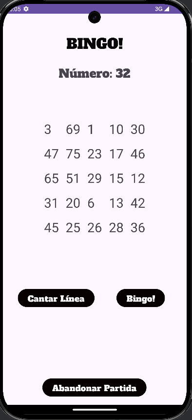
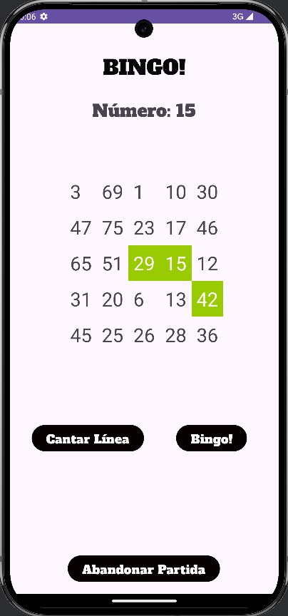
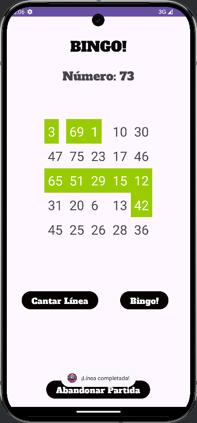
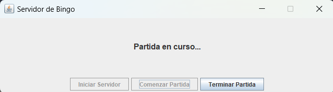

# Bingo App 

¡Bienvenido/a a la aplicación de Bingo para Android! Este proyecto está diseñado para ofrecer una experiencia divertida y dinámica de jugar al Bingo en línea dentro de una misma red WiFi.

**Nota**: Esta aplicación está en versión ALPHA y puede contener fallos. La aplicación tan solo muestra los cartones de bingo, la partida se debe buscar en un medio externo (p.e. https://youtu.be/uuE_2QUKQds?si=ZNAepm5-1Jvb_ifN).

## Características principales

- **Juego multijugador local**: Juega partidas de Bingo con amigos conectados a la misma red WiFi.
- **Servidor dedicado**: La sincronización de las partidas se realiza a través de un servidor integrado que maneja las conexiones de los jugadores.
- **Interfaz amigable**: Diseño intuitivo y fácil de usar para una experiencia de juego fluida.

## Requisitos

### Para el cliente (Android):

- Un dispositivo con Android 13 (Tiramisú) o superior.
- Conexión a una red WiFi compartida con otros jugadores.

### Para el servidor:

- Java 11 o superior.
- Una máquina conectada a la misma red WiFi que los dispositivos Android.

## Instalación y ejecución

### Cliente (Aplicación Android):

1. Clona este repositorio:
   ```bash
   git clone https://github.com/DanielPinaa/BINGO.git
   ```
2. Abre el proyecto en Android Studio.
3. Conecta un dispositivo Android físico o configura un emulador con Android 13 o superior.
4. Ejecuta la aplicación desde Android Studio.

### Servidor:

1. Navega al directorio `Servidor Bingo` dentro del repositorio.
2. Compila el servidor utilizando algún IDE (se recomienda Visual Studio Code en su última versión)
3. Ejecuta el servidor (se recomienda de nuevo usar Visual Studio Code).

## Uso

1. Ejecuta el servidor en una máquina conectada a la red WiFi.
2. Abre la aplicación de Bingo en cada dispositivo Android.
3. Los jugadores pueden unirse a la partida introduciendo la dirección IP del servidor.
4. Disfruta de una partida de Bingo sincronizada en tiempo real.

## Estructura del proyecto

### Cliente (Android):

- `MainActivity.java`: Actividad principal de la aplicación.


- `Multijugador.java`: Manejo de la lógica para las partidas multijugador.


- `Partida.java`: Representación y gestión de una partida de Bingo.

 



- `Fin.java`: Visualización del ganador de la partida.


### Servidor:

- `BingoServer.java`: Lógica principal del servidor, gestiona las conexiones y la comunicación entre clientes.
- `Jugador.java`: Representación de un jugador dentro del servidor.
- `App.java`: Interfaz realizada con Swing para un mejor manejo del servidor.

 
 

## Contribuciones

Si encuentras errores o tienes ideas para mejorar el proyecto, no dudes en abrir un issue o enviar un pull request.

---

**Aviso:** Esta aplicación está en versión ALPHA. Aunque se ha probado en escenarios limitados, pueden surgir errores inesperados. Si experimentas problemas, por favor infórmalo en la sección de issues del repositorio.

